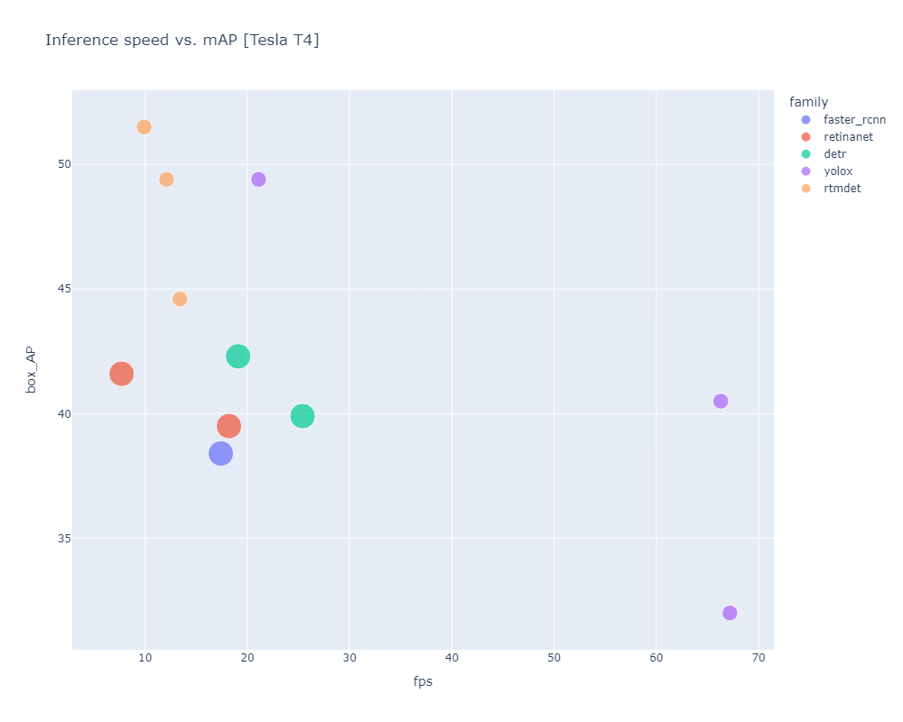

# mmdet_benchmark

This repo is a simple benchmark for mmdetection. It is based on the official mmdetection benchmarking code and inspired by Jeremy Howard and Timm's [benchmarking code](https://colab.research.google.com/corgiredirector?site=https%3A%2F%2Fwww.kaggle.com%2Fcode%2Fjhoward%2Fwhich-image-models-are-best).

Find the associated colab notebook [here](https://colab.research.google.com/drive/1Uet_iLWuqOZI-FIgtR7eBvqL4_Aue4mf?usp=sharing)

